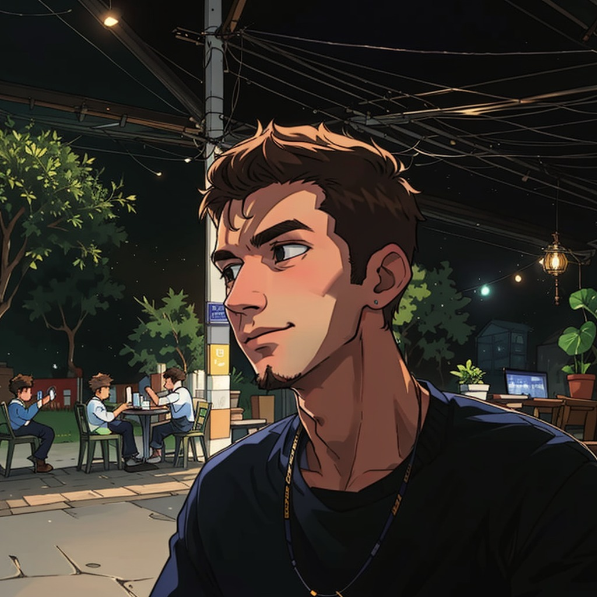

___

    <link
    rel="stylesheet"
    href="https://cdn.jsdelivr.net/gh/dheereshagrwal/colored-icons@master/ci.min.css"
    />
    

        
        <a href="https://www.instagram.com/jpmoncao">
            <i class="ci ci-instagram-light ci-2x"></i>
        </a>
        <a href="https://twitter.com/jp_moncao">
            <i class="ci ci-twitter-light ci-2x"></i>
        </a>
        <a href="https://www.linkedin.com/in/jpmoncao/">
            <i class="ci ci-linkedin-light ci-2x"></i>
        </a>
        <a href="https://open.spotify.com/user/qmyn775x7m8bycxdpl0ynvz3e?si=d5ce71814dfd445d&nd=1">
            <i class="ci ci-spotify-light ci-2x"></i>
        </a>
        <a href="https://github.com/jpmoncao">
            <i class="ci ci-github-light ci-2x"></i>
        </a>
    

    

        

            <h3 style="display: inline"><strong>Hello World</strong></h3>, my name is <strong>João Pedro</strong>! I'm <strong>17 years</strong> old, and I <strong>currently work as a web and desktop developer</strong> in São Paulo, <strong>Brazil</strong>. I love programming, and I discovered this during the pandemic. Today, I have been studying technology for three years, and <strong>I'm eager to learn more</strong>. I hope you enjoy my repositories. If possible, please <strong>give them a star and fork them</strong>!
            I'm excited to get to <strong>know you better...</strong>
        

        

        

            <h3 style="display: inline"><strong>Olá Mundo</strong></h3>, meu nome é <strong>João Pedro</strong>! Tenho <strong>17 anos</strong>, e <strong>atualmente trabalho como desenvolvedor web e de desktop</strong> em São Paulo, <strong>Brasil</strong>. Eu amo programação, e descobri isso durante a pandemia. Hoje, estudo tecnologia há três anos, e <strong>estou ansioso para aprender mais</strong>. Espero que você goste dos meus repositórios. Se possível, por favor, <strong>dê a eles uma estrela e faça um fork</strong>!
            Estou animado para <strong>conhecê-lo melhor...</strong>
        

        

        

            

                <h3>About Me</h3>
                <ul style="margin-left: -1.75rem;">
                    <li>🙏 I'm Christian</li>
                    <li>🏀 I play basketball</li>
                    <li>🧩 My favorite language is TypeScript</li>
                    <li>☕ I love coffee!</li>
                    <li>🌎 I want to save the world!</li>
                    <li>📖 My favorite hobby is learning new things</li>
                    <li>🏷️ I have very interesting links: <a href="https://linktr.ee/jpmoncao">click here!</a></li>
                </ul>
            

            
        

    

    

___

<h4><em>Nós O amamos porque Ele nos amou primeiro. 
1 Jo 4:19</em></h4>

